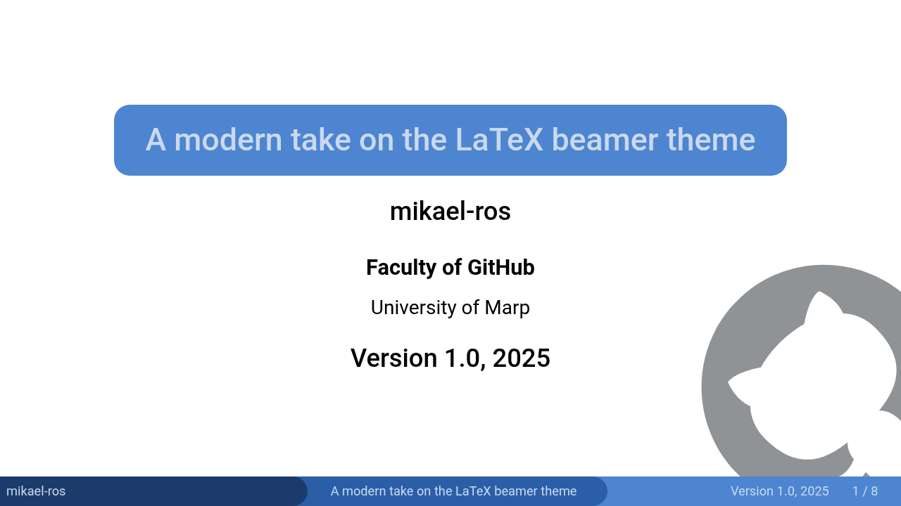
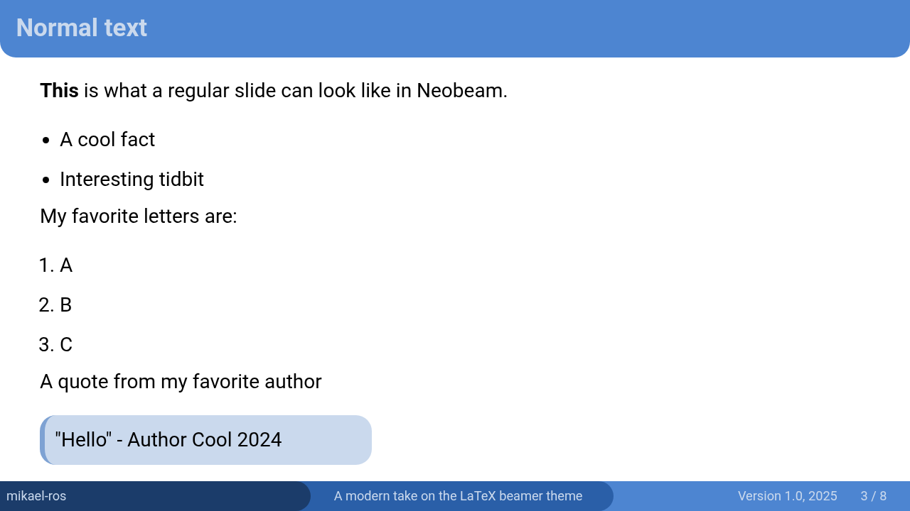
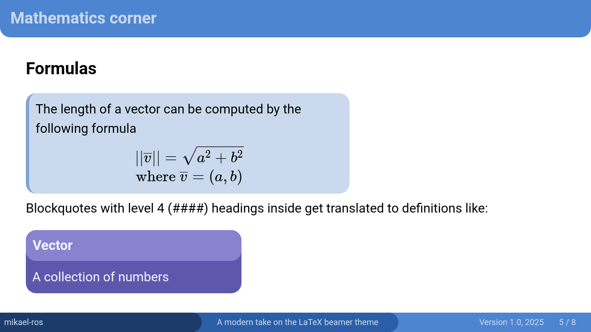
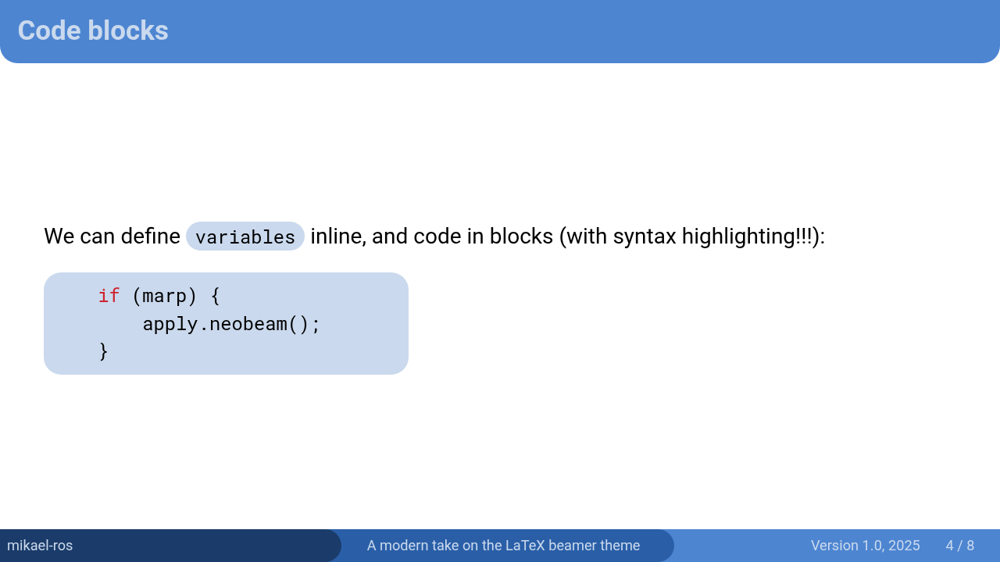
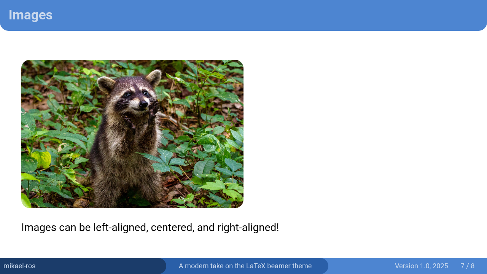
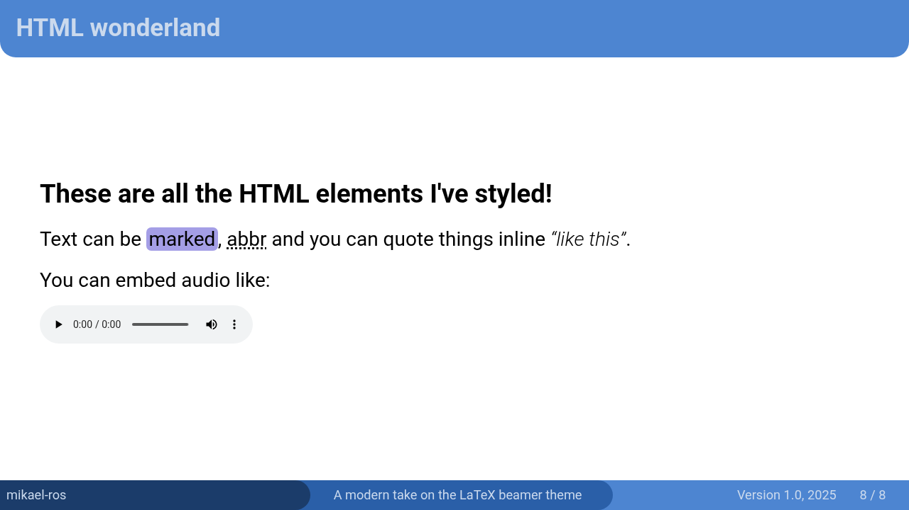
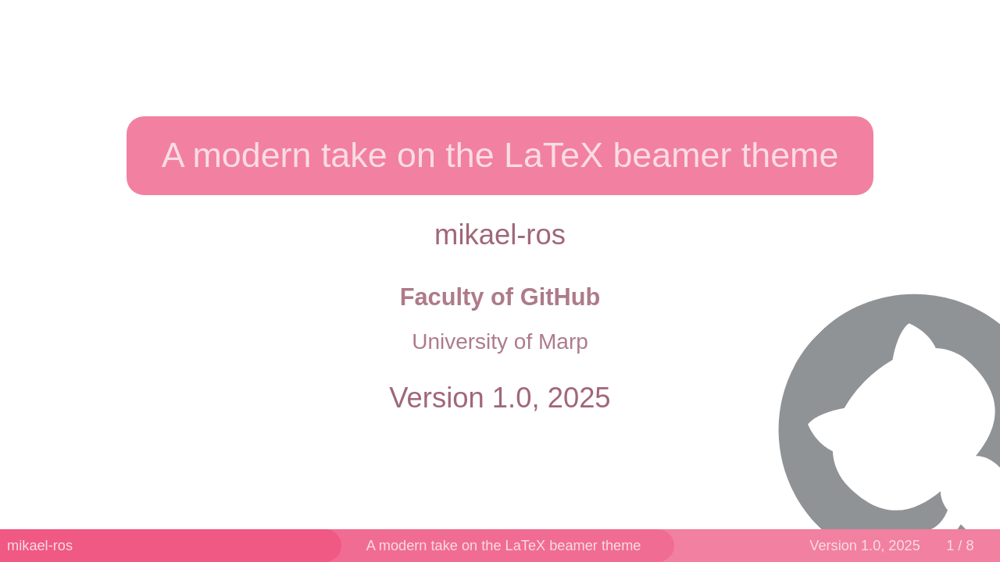
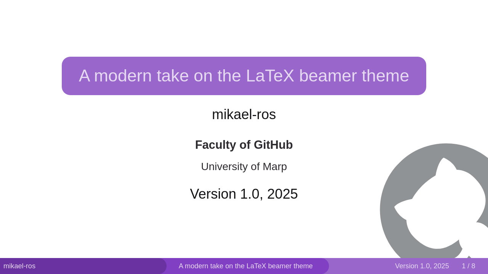
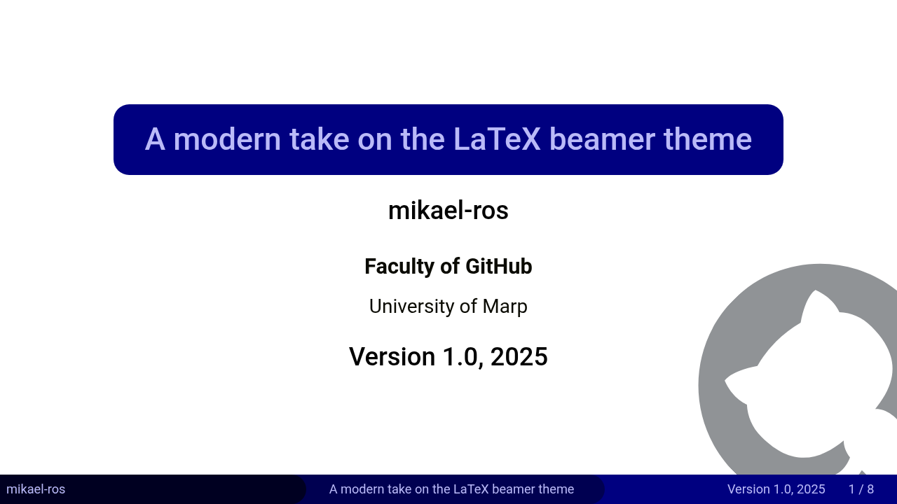

<p align="center">
    
</p>

[](https://github.com/marp-team/awesome-marp)

## ✨️A modern take on LaTeX beamer 
### A Marp theme

Find the classic beamer outdated? Are your students losing focus due to it? 💤

I'm not sure how to solve the last one, but this theme is my attempt to address the first issue: too many a new presentation look decades old due to the classic look of beamer.

> [!NOTE]
> _[Marp](https://marp.app/) is a presentation framework that allows users to create presentations with Markdown and CSS._
>
> Inspired by, but not affiliated with or sourced from, the Marp [beam theme made by rnd195](https://github.com/rnd195/my-marp-themes). As mentioned, I have not used any of their code to create this theme.

<a href='https://ko-fi.com/Z8Z212GZR6' target='_blank'></a>

#### Disclaimer

> [!IMPORTANT]
> **None of the following is legal advice. Consult a professional**.
> This theme uses free-to-use fonts, and should be okay for personal use, but do conduct your own research before hosting any large presentation with it.
>
> Consider the [license](LICENSE) of this project as well, and Marp's license itself.
>
> All fonts used in the theme by default are imported from Google Fonts. Consider the privacy aspects of this yourself and choose wheter you want local installs of them or not. This was a choice made to enable direct linking of the theme to work.

---
## 📺 Previews
### 🔴 [Live preview](https://mikael-ros.github.io/neobeam/neobeam) 🔴
> Live previews for the other color schemes further down!

### Static previews
N<sub>E</sub>Obeam            |  beamer
:-------------------------:|:-------------------------:
  |  

Image on the right courtesy of [latextemplates.com](https://www.latextemplates.com). Will eventually be replaced by my own.

#### Main title

#### A slide with text

#### Science slides
Math            |  Code
:-------------------------:|:-------------------------:
  |  
### Special elements
Images            |  Tables
:-------------------------:|:-------------------------:
  |  
#### HTML styling
> [!NOTE]
> This is optionally enabled! See features & quirks.



### 🖌️ Theme versions
> Click on the theme to see a live preview

Theme | Based on
:----:|:--------:
[neobeam](https://mikael-ros.github.io/neobeam/neobeam)|
[neobeam-beamer](https://mikael-ros.github.io/neobeam/beamer) | beamer color scheme
[neobeam-dsek](https://mikael-ros.github.io/neobeam/dsek) | [LTH D-sektionen design profile](https://www.dsek.se/en/documents/governing)
[neobeam-csek](https://mikael-ros.github.io/neobeam/csek) | [LTH C-sektionen design profile](https://www.dsek.se/en/documents/governing)
[neobeam-lund](https://mikael-ros.github.io/neobeam/lund) | [Lund University design profile](https://www.medarbetarwebben.lu.se/stod-och-verktyg/kommunikation-och-grafisk-profil/grafisk-profil-och-logotyp)

#### Some static previews
> More are available in the repo!

 Default | beamer theme | LTH D-sektionen | LTH C-sektionen | LTH/Lund University 
:-------------------------:|:-------------------------:|:-------------------------:|:-------------------------:|:-------------------------:
  |  |  |  | 

---

## ⌨️ Usage
> [!NOTE]
> Until a future timepoint, I won't provide a guide on how to use it with Marp CLI, as I expect CLI users to be technical enough to know how to do this. You can read the [Marp CLI documentation here](https://github.com/marp-team/marp-cli), and inspect the [preview creation script](/example/create-previews.sh) for some examples.
### 🛠 Prerequisites
- Git or zip
- Visual Studio Code
- Marp Extension for Visual Studio Code

> [!TIP]
> This theme by default uses the fonts Roboto, Roboto Mono (for code) and Noto Sans Math (for math). These are imported in the CSS file, but you can aquire them yourself too, or change them out. In the LTH C-sektionen and D-sektionen themes, Roboto is switched out for Helvetica.

> [!WARNING]
> For reasons beyond my comprehension, it is necessary to use different notation for ``hsl`` in CSS in the Marp VS code preview as compared to the build version sometimes. To mitigate this I have added a ``build-multiplier`` variable to the CSS files. Set this to ``1`` when necessary, otherwise ``100``.

#### 📥 In an existing presentation
1. Download or copy the neobeam.css file into your project OR use the direct link. If using specific themes, do remember they are dependent on the base theme.
2. Add it to your VSCode settings by editing your ``.vscode/settings.json`` file and appending:
```json
  //...
  {
      "markdown.marp.themes": [
          //...
          "path/to/neobeam.css"
          //...
      ]
  }
  //...
```
where ``path/to/neobeam.css`` is either local, for example ``css/neobeam.css`` or the direct link to the repo's CSS file, ex: ``https://raw.githubusercontent.com/mikael-ros/neobeam/main/css/neobeam.css``. Keep in mind that using the direct link might cause your presentation to change over time and it's best you have a local copy instead. When you are using any derivative theme, you also need to import the base neobeam theme.

3. Add it to your Marp presentation by adding:
```markdown
marp: true
theme: neobeam
paginate: true
math: katex
footer: '**Author**
         **Title**
         **Conference/course/e.t.c.**'
```
The theme names are written as presented in the table in the previews section.
4. Change ``build-multiplier`` to ``1``, if the preview looks wrong. Do not forget to change it back before you build.

> If you are, against all odds, using more than 1000 slides, and the pagination wraps, go into [``neobeam.css``](css/neobeam.css) and modify ``section::after``'s ``width``, and correspondingly the ``--pagination-space`` in ``footer > *:last-child``.

#### ✨️ As a template
Simply clone or fork this repo or download the release. If you wish, you can delete the previews folder. 

All themes are registered and ready in the template.

---

## 🪄 Features & quirks
Most things work like you'd expect, but there are some quirks to keep the cogs turning.
### Theming
It is since v0.5 very easy to change the theme. There are now simple variables in each CSS file, where it adjusts the colors and everything else completely automatically. 

### Title slide
I opted not to always treat the first slide as a title slide, so to declare a slide (any slide actually) a title slide, add the following before the content: ``<!-- _class: title -->``. 

Heres an example of a title slide. As long as you follow as similar format it should work. Theres also an optional logo slot for a University logo or similar.
```html,markdown
<!-- _class: title -->
# Title

## Author

> ### Faculty
> University

## Conference/course/e.t.c.


```

Like other images, the logo can be assigned left side too.

### Footers
Every page has a footer. It's made from the footer content defined in the beginning of the presentation markdown, and the sections are split by using ** (to create children objects). The footer is a flex-box and I've made it split itself into three sections. You could likely with some modifications change this fairly easily.
### Math
I've opted to use KaTeX, and have not styled for other options yet.
### Definitions
To make LaTeX style bubble definitions I've had to do a slight work around to avoid using HTML in Marp. To define a definition, write the following:
```markdown
    > #### Definition title
    > Definition description
```
The first 3 of these will have unique colors, but after that all of them will have the same. If you wish to add more, change the CSS-file around the ``blockquote:nth-of-type`` part of the stylesheet.
### Image alignment
This stylesheet supports adding a tag in the alt text for ``left``, ``center`` and ``right`` alignment. To define this, you would write something like: ````. Do note this might cause issues when using these words in your alt text in a normal sentence.
### HTML support
There is light HTML support, including the elements:
- ``<mark>`` (highlighting)
- ``<q>`` (inline quotes)
- ``<var>`` (variables)
- ``<samp>`` (code output)
- ``<audio>`` (audio)
- ``<abbr>`` (abbreviations).

To enable HTML support add or modify the line ``"markdown.marp.enableHtml": true`` in ``.vscode/settings.json``. 

> [!WARNING] 
> Considering the [security issues mentioned in Marps documentation](https://github.com/marp-team/marp-vscode#enable-html-in-marp-markdown-%EF%B8%8F), this is disabled by default, even in the template. You may need to restart Visual Studio Code after changing the setting. You will need to export in HTML for interactive elements to function.

---

**Feel free to contribute** 💙
